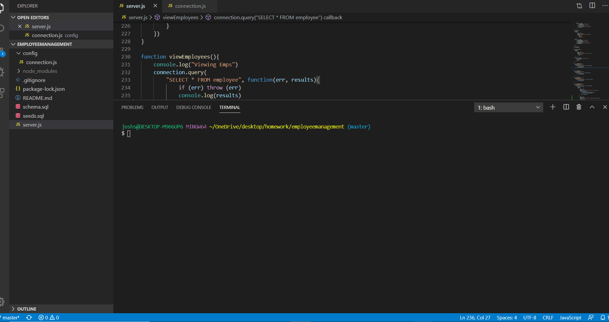

# employeemanagement
## Description
I have created this command line employee management system to provide businesses with an easy way to keep track of basic information regarding their employees.

## Installation
In order to install this project please navigate to the following [link](https://github.com/Jsegel9/employeemanagement) and clone the repository. Open the repository in VS code and open the root directory in terminal. Run NPM install in order to install all the necessary dependencies.

## Usage
After installing dependencies with the root directory still open in terminal, run the command node server.js to run the app. Answer the prompts that follow to enter, update or view your employees, departments or roles.
A gif featuring the functionality of the app can be found below.

## License
Copyright (c) [2019] [Joshua Patrick Segel]

Permission is hereby granted, free of charge, to any person obtaining a copy
of this software and associated documentation files (the "Software"), to deal
in the Software without restriction, including without limitation the rights
to use, copy, modify, merge, publish, distribute, sublicense, and/or sell
copies of the Software, and to permit persons to whom the Software is
furnished to do so, subject to the following conditions:

The above copyright notice and this permission notice shall be included in all
copies or substantial portions of the Software.

THE SOFTWARE IS PROVIDED "AS IS", WITHOUT WARRANTY OF ANY KIND, EXPRESS OR
IMPLIED, INCLUDING BUT NOT LIMITED TO THE WARRANTIES OF MERCHANTABILITY,
FITNESS FOR A PARTICULAR PURPOSE AND NONINFRINGEMENT. IN NO EVENT SHALL THE
AUTHORS OR COPYRIGHT HOLDERS BE LIABLE FOR ANY CLAIM, DAMAGES OR OTHER
LIABILITY, WHETHER IN AN ACTION OF CONTRACT, TORT OR OTHERWISE, ARISING FROM,
OUT OF OR IN CONNECTION WITH THE SOFTWARE OR THE USE OR OTHER DEALINGS IN THE
SOFTWARE.  
## Contributing
Feel free to use this github repository to build your own employee manager. If you have any improvements or contributions you wild like to make please contact me at <Segeljosh@gmail.com>

